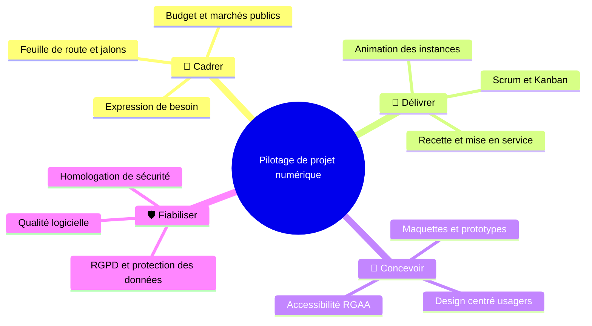
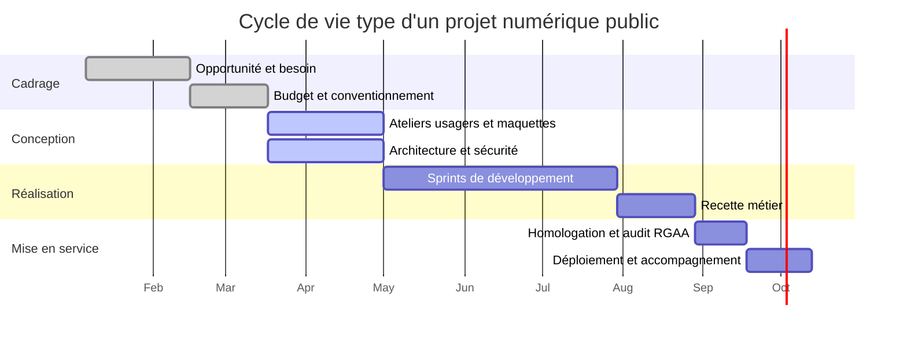

<picture>
  <source media="(prefers-color-scheme: dark)" srcset="https://readme-typing-svg.demolab.com?font=Fira+Code&weight=600&size=21&duration=3200&pause=900&color=8B8BF6&center=true&vCenter=true&width=720&height=48&lines=Pilotage+de+projets+num%C3%A9riques+au+sein+d%27un+minist%C3%A8re;Agilit%C3%A9+%C2%B7+Accessibilit%C3%A9+%C2%B7+Design+centr%C3%A9+usagers;Du+cadrage+%C3%A0+la+mise+en+service%2C+avec+m%C3%A9thode" />
  
</picture>

 

## 🧭 À propos

Ingénieur logiciel de formation devenu chef de projet, je pilote des **projets numériques au sein d'un ministère français**. Après plusieurs années consacrées aux systèmes d'information de la santé et du secteur social, je mets cette double culture — technique et conduite de projet — au service de la transformation de l'action publique : traduire un besoin métier en service qui fonctionne, dans les délais et dans le cadre réglementaire.

> « Un service public numérique réussi, c'est celui que l'usager utilise sans y penser : simple, accessible, fiable. »

## 🗺️ Carte des compétences

## 🏛️ Terrains d'action

| 🏥 **Santé numérique** | 🤝 **Solidarités & social** | 🏛️ **Services de l'État** |
|:---:|:---:|:---:|
| Systèmes d'information de santé | Applications des politiques sociales | Transformation numérique ministérielle |

## 🧰 Outils du quotidien

<!-- Ajustez la liste : https://skillicons.dev -->

🗓️ <b>Déformation professionnelle — même ce README a son diagramme de Gantt</b>

 

## 📊 Activité GitHub

<picture>
  <source media="(prefers-color-scheme: dark)" srcset="https://github-readme-stats.vercel.app/api?username=jeremieconte&show_icons=true&include_all_commits=true&count_private=true&locale=fr&rank_icon=github&title_color=8B8BF6&icon_color=E1000F&text_color=C9D1D9&bg_color=0D1117&border_color=30363D" />
  
</picture>
<picture>
  <source media="(prefers-color-scheme: dark)" srcset="https://streak-stats.demolab.com?user=jeremieconte&locale=fr&background=0D1117&border=30363D&ring=8B8BF6&fire=E1000F&currStreakLabel=8B8BF6&currStreakNum=C9D1D9&sideNums=C9D1D9&sideLabels=C9D1D9&dates=8B949E" />
  
</picture>

<picture>
  <source media="(prefers-color-scheme: dark)" srcset="https://github-readme-stats.vercel.app/api/top-langs/?username=jeremieconte&layout=compact&locale=fr&title_color=8B8BF6&text_color=C9D1D9&bg_color=0D1117&border_color=30363D" />
  
</picture>

  

<!-- Animation générée par le workflow .github/workflows/snake.yml -->
<picture>
  <source media="(prefers-color-scheme: dark)" srcset="https://raw.githubusercontent.com/jeremieconte/jeremieconte/output/github-snake-dark.svg" />
  
</picture>

